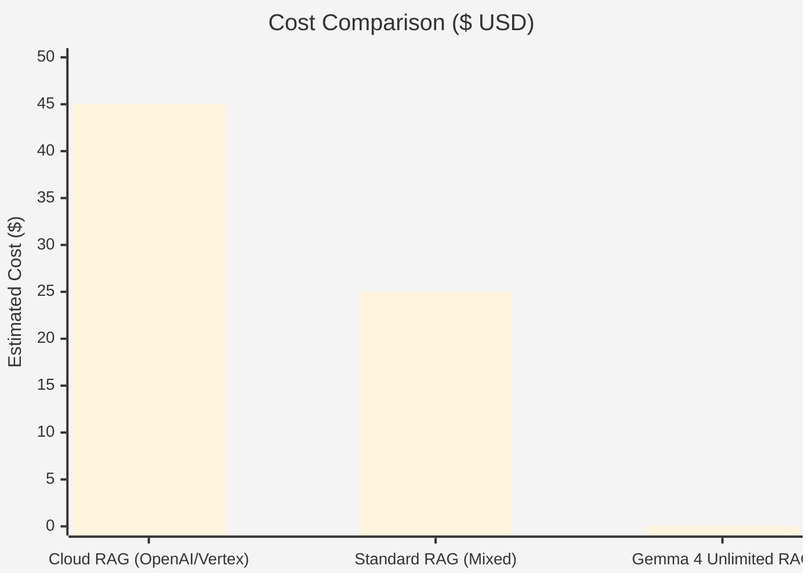
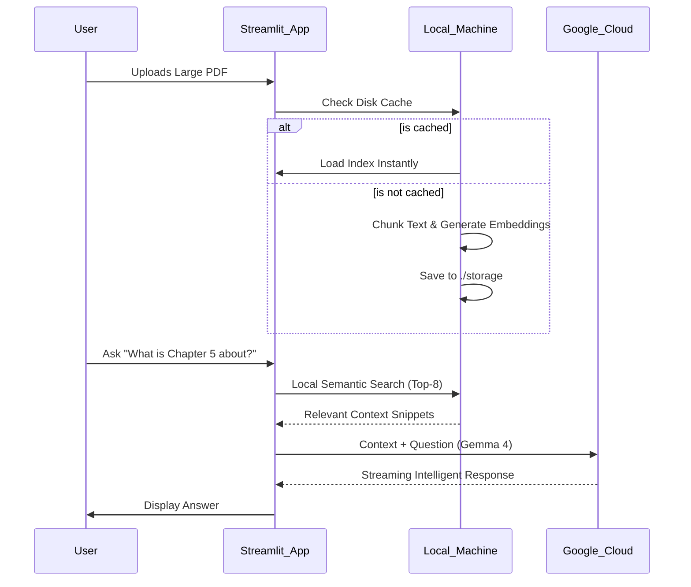
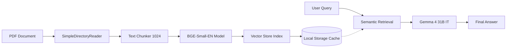

# 📚 Gemma 4: Unlimited Book Chatbot

Query massive PDF books (500+ pages) with zero cost and high privacy using a **Hybrid RAG** architecture. Powered by **Gemma 4 31B** and **Local Embeddings**.

---

## 🚀 Why This Project is Unique?

| Feature | Standard RAG | **Gemma 4 Unlimited RAG** |
| :--- | :--- | :--- |
| **Embedding Cost** | Paid (Per Token) | **$0 (Processed Locally)** |
| **Quota Limits** | Frequent API Throttling | **Unlimited (Hardware Dependent)** |
| **Privacy** | Full text sent to Cloud | **Local Processing (Only snippets sent)** |
| **Latency** | Repeated Indexing | **⚡ Instant-load Cache System** |

---

## 📊 Cost Analysis (Per 10,000 Pages)

Comparing traditional Cloud-only RAG vs. our **Hybrid Local Embedding** approach.



---

## 🏗️ System Architecture

This project uses a **Hybrid Cloud-Local** model. The "Heavy Memory" (Vector Search) happens on your machine, while the "Advanced Reasoning" (LLM) happens in the cloud.



---

## 🔄 Data Processing Flow



---

## 📂 Project Structure

```text
Rag_Bot/
├── src/
│   ├── config.py      # Configuration and Environment loading
│   ├── engine.py      # Core RAG logic (Indexing, Querying)
│   └── utils.py       # Helper functions and logging
├── app.py             # Main Streamlit UI
├── docs/              # Detailed Technical Documentation
├── storage/           # Local index cache (gitignored)
├── Dockerfile         # Container definition
├── docker-compose.yaml # Multi-container orchestration
└── requirements.txt   # Dependencies
```

## 🛠️ Installation & Setup

### Option 1: Using Docker (Recommended)

This is the easiest way to run the project. It handles all dependencies and automatically uses your GPU if available.

1. **Install Docker** and **Docker Compose**.
2. **Configure Environment**:
   Create a `.env` file and add your API key:
   ```bash
   GEMINI_API_KEY=your_google_ai_studio_api_key
   ```
3. **Run the App**:
   ```bash
   docker compose up --build
   ```
4. Access the app at `http://localhost:8501`.

*Note: For GPU support in Docker, ensure you have the [NVIDIA Container Toolkit](https://docs.nvidia.com/datacenter/cloud-native/container-toolkit/latest/install-guide.html) installed.*

### Option 2: Local Installation (Manual)

1. **Clone the repo**:
   ```bash
   git clone https://github.com/your-username/Rag_Bot.git
   cd Rag_Bot
   ```

2. **Create a Virtual Environment**:
   ```bash
   # Windows
   python -m venv .venv
   .venv\Scripts\activate

   # Linux/macOS
   python3 -m venv .venv
   source .venv/bin/activate
   ```

3. **Install Dependencies**:
   ```bash
   pip install -r requirements.txt
   ```

4. **Configure Environment**:
   Create a `.env` file and add your API key:
   ```bash
   GEMINI_API_KEY=your_google_ai_studio_api_key
   ```

5. **Run the App**:
   ```bash
   streamlit run app.py
   ```

---

## ⚖️ License
This project is open-source and available under the MIT License.
