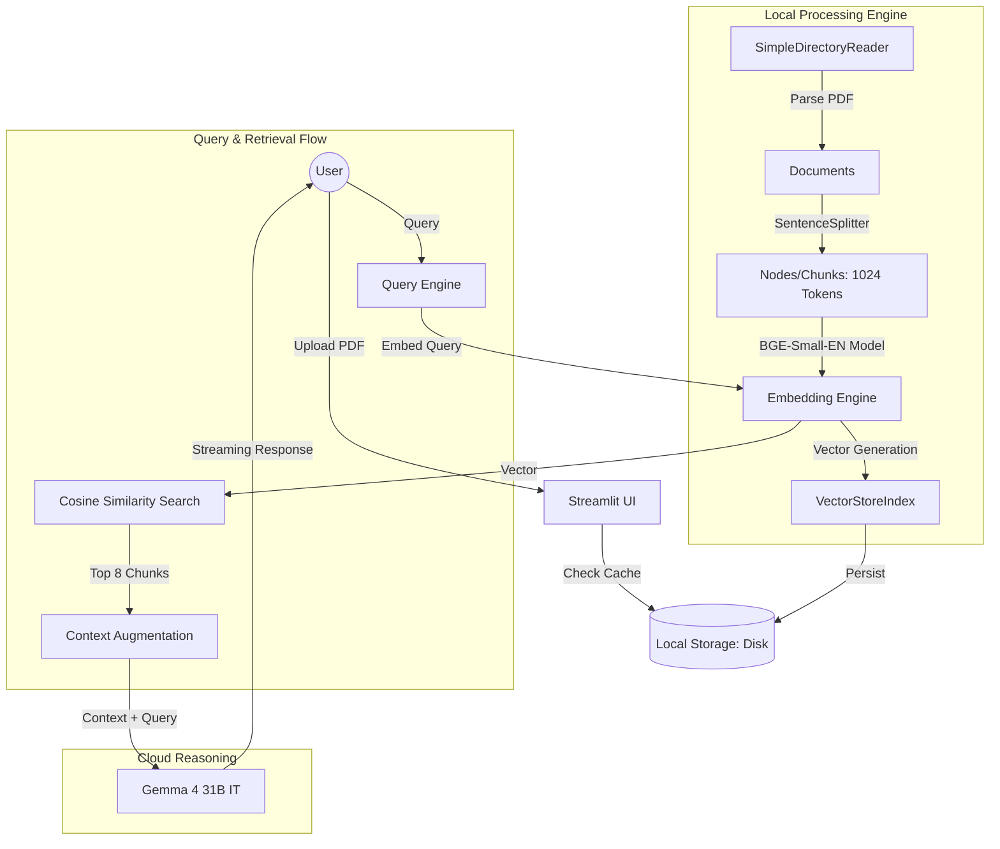

# Technical Architecture & System Design: Gemma 4 Unlimited RAG

## 1. Executive Summary
The **Gemma 4 Unlimited RAG** is a high-performance, privacy-centric Retrieval-Augmented Generation (RAG) system designed for deep interaction with large-scale PDF documents (500+ pages). The core philosophy is **Local Heavy Indexing, Cloud Light Reasoning**: keeping the massive data processing local to ensure privacy and eliminate token costs, while leveraging Google's Gemma 4 (31B) for high-level reasoning.

---

## 2. System Architecture Hierarchy

### 2.1 Overview Diagram


---

## 3. Project Structure
The project follows a modular design to separate UI concerns from core RAG logic.

```text
Rag_Bot/
├── src/
│   ├── config.py      # Constants, Model IDs, and Environment loading
│   ├── engine.py      # Core RAG logic (Indexing, Querying, Settings)
│   └── utils.py       # Logging, directory management, and helpers
├── app.py             # Main Streamlit application
├── storage/           # Local cache for vector indices
├── docs/              # Technical documentation
└── requirements.txt   # Project dependencies
```

## 4. Deep Dive: The Data Lifecycle

### 3.1 Data Ingestion & Transformation (Chunking)
The system uses a **Hierarchical Structural Splitter** to transform unstructured PDF text into searchable units.

*   **Step 1: Parsing:** `pypdf` extracts text from each page, creating a `Document` object with metadata (page numbers, filename).
*   **Step 2: Tokenization:** The system uses a token-based approach rather than character-based. This aligns with how LLMs "see" text.
*   **Step 3: Sentence-Aware Chunking:**
    *   **Algorithm:** Greedy Recursive Character/Sentence Splitting.
    *   **Chunk Size:** 1024 Tokens.
    *   **Chunk Overlap:** 200 Tokens (Sliding Window).
    *   **Logic:** The splitter attempts to find the largest block of text < 1024 tokens that ends with a paragraph break (`\n\n`). If not found, it settles for a sentence break (`. `), ensuring semantic units are never cut in half.

### 3.2 Embedding & Vectorization
*   **Model:** `BAAI/bge-small-en-v1.5` (Running via `SentenceTransformers` + `PyTorch`).
*   **Dimensionality:** 384 dimensions.
*   **Execution:** Executed locally on CPU or CUDA.
*   **Batching:** Processes 32 chunks simultaneously to maximize hardware utilization.

---

## 4. Retrieval & Similarity Logic

### 4.1 Search Algorithm
The system utilizes **Dense Vector Retrieval** via **Cosine Similarity**.

$$ \text{similarity} = \cos(\theta) = \frac{\mathbf{A} \cdot \mathbf{B}}{\|\mathbf{A}\| \|\mathbf{B}\|} $$

1.  The user's query is embedded into the same 384-dimensional space as the chunks.
2.  A dot product calculation is performed against all vectors in the index.
3.  The top **8 most similar chunks** (`similarity_top_k=8`) are retrieved.

### 4.2 Context Augmentation
The retrieved chunks are concatenated into a "Context Block." This block, along with the user's chat history and the original query, is wrapped in a system prompt and sent to the LLM.

---

## 5. Persistence Strategy
To prevent re-indexing the same book multiple times, the system implements a **File-Hash Based Caching Layer**.

*   **Location:** `./storage/<sanitized_filename>/`
*   **Components Persisted:**
    *   `vector_store.json`: The embedding vectors.
    *   `docstore.json`: The raw text chunks and metadata.
    *   `index_store.json`: The index structure.

---

## 6. Model Specifications
| Component | Technical Detail |
| :--- | :--- |
| **LLM** | Google Gemma 4 31B Instruction-Tuned |
| **Embedding** | BGE Small v1.5 (Local) |
| **Framework** | LlamaIndex 0.10+ |
| **UI** | Streamlit |
| **Device Support** | Auto-detection (CUDA/MPS/CPU) |

---

## 7. Operational Flows

### 7.1 Indexing Flow
1. User uploads PDF.
2. System checks `./storage/` for matching filename.
3. If not found:
    - PDF is parsed to `Documents`.
    - `Documents` are split into `Nodes` (1024 tokens).
    - `Nodes` are embedded using `BGE-Small`.
    - `VectorStoreIndex` is built and saved to disk.

### 7.2 Query Flow
1. User enters text.
2. Query is embedded.
3. Vector search identifies top 8 chunks.
4. Chunks + Chat History are sent to Gemma 4 via Google GenAI API.
5. Response is streamed back to the UI in real-time.
