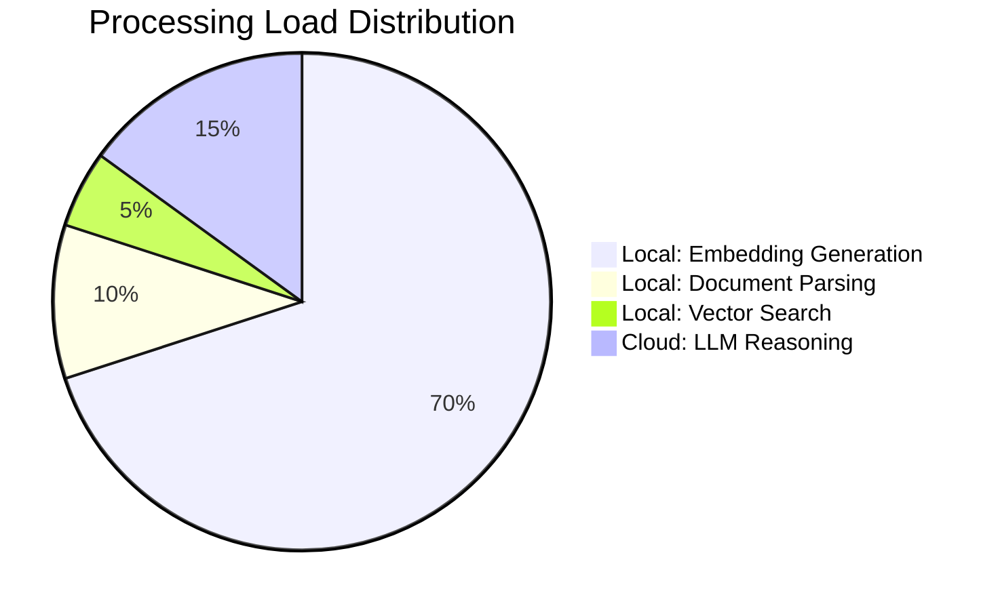

# Functional Requirements Document (FRD) - Gemma 4 Unlimited RAG

## 1. Technical Stack
- **Frontend**: Streamlit (Python)
- **RAG Framework**: LlamaIndex
- **Embeddings (Local)**: HuggingFaceEmbedding (`BAAI/bge-small-en-v1.5`)
- **LLM (Cloud)**: Google GenAI (`Gemma-4-31b-it`)
- **Persistence**: LlamaIndex `StorageContext` (Local Disk)
- **Hardware**: CPU/GPU (via PyTorch)

## 2. System Architecture
The system follows a **Separation of Concerns** model where expensive/heavy compute is handled by Google Cloud, while privacy-sensitive and volume-heavy indexing is handled by the Local Client.

### Data Architecture Diagram

## 3. Functional Requirements

### FR1: Local Indexing Engine
- **Requirement**: The system MUST generate embeddings locally without calling any external API.
- **Specification**: Use `HuggingFaceEmbedding` with `device` detection (CUDA/CPU).
- **Batching**: Use `embed_batch_size=32` to optimize hardware throughput.

### FR2: Semantic Search & Retrieval
- **Requirement**: The system MUST retrieve context based on semantic meaning rather than keyword matching.
- **Optimization**: `similarity_top_k` is set to 8 to balance context richness with token limits.
- **Chunking**: `chunk_size` is fixed at 1024 to ensure semantic coherence.

### FR3: Persistence & Caching
- **Requirement**: The system MUST save generated indices to disk.
- **Specification**: Indices are stored in `./storage/<filename_hash>/`.
- **Loading**: If a directory exists for a filename, the system MUST skip re-indexing and load from storage.

### FR4: Conversation Management
- **Requirement**: The system MUST maintain a chat history for the current session.
- **UI Element**: A "Clear Chat History" button MUST reset the session state history.
- **Reset Logic**: A "Reset & New Book" button MUST purge the `index` and `current_file_name` states.

## 4. Hardware/Environment Requirements
- **RAM**: Minimum 8GB (for loading embedding models and PDF parsing).
- **Disk**: 500MB+ for local model storage and index cache.
- **Internet**: Required for Cloud LLM (Gemma 4) communication.

## 5. Security & Privacy
- **API Keys**: Stored in `.env` and NEVER committed to GitHub.
- **Data Locality**: The full PDF text stays on the user's machine. Only specific, retrieved snippets are sent to the cloud for response generation.
