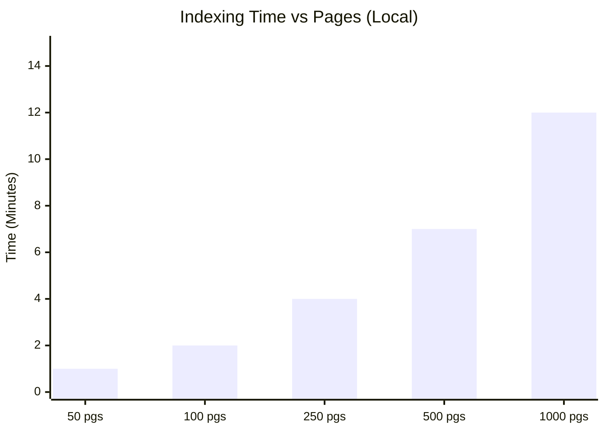
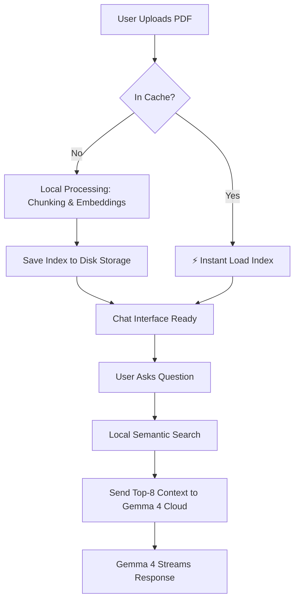

# Product Requirements Document (PRD) - Gemma 4 Unlimited RAG

## 1. Overview
Gemma 4 Unlimited RAG is a privacy-first, cost-optimized "Hybrid RAG" application. It allows users to chat with large documents (PDFs) by combining state-of-the-art cloud reasoning (Gemma 4) with zero-cost local embedding processing.

## 2. Problem Statement
Standard RAG applications often face three hurdles:
1. **API Costs**: High per-token costs for embedding large books.
2. **Quota Limits**: Frequent "Rate Limit Reached" errors when processing high-volume text.
3. **Latency**: Re-indexing the same file multiple times is time-consuming and inefficient.

## 3. Target Audience
- **Students/Researchers**: Deep-diving into 500+ page textbooks.
- **Data Engineers**: Chatting with technical documentation and manuals.
- **Privacy-Conscious Users**: Keeping the bulk of their document processing on local hardware.

## 4. Key Features
- **Local Embedding Engine**: Zero-cost indexing using `bge-small-en-v1.5`.
- **Hybrid Architecture**: Local "Memory" (Embeddings) + Cloud "Brain" (Gemma 4 31B).
- **Persistent Indexing**: ⚡ Instant-load cache for previously processed files.
- **Streaming Interface**: Real-time response generation for a modern chat experience.
- **Multi-File Management**: Easy "Reset" and "Switch" logic for handling different documents.

## 5. Success Metrics
- **Zero Cost**: $0 spent on embedding API tokens.
- **Speed**: < 2 seconds to load a previously indexed 1000-page book.
- **Accuracy**: Precise "Top-8" retrieval depth for comprehensive context.

## 7. Performance Benchmarks (Local CPU)
Expected indexing times for different document sizes on a standard local machine.

## 8. High-Level Logic Flow

